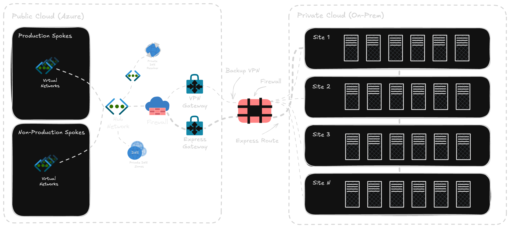
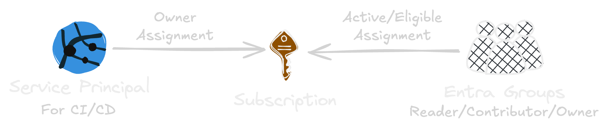
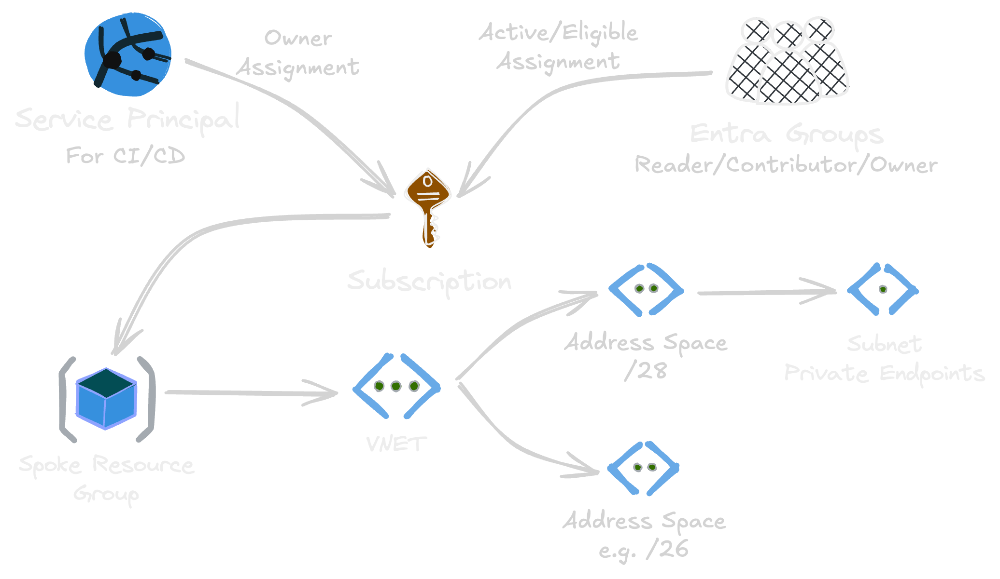
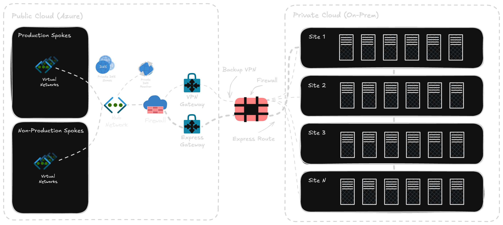
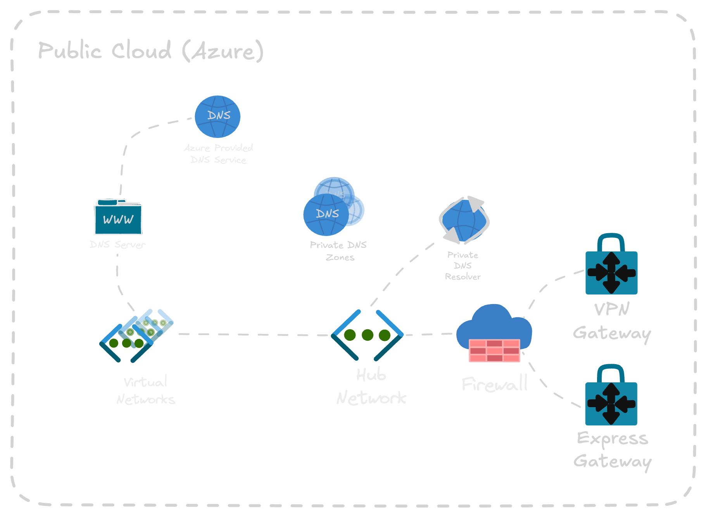
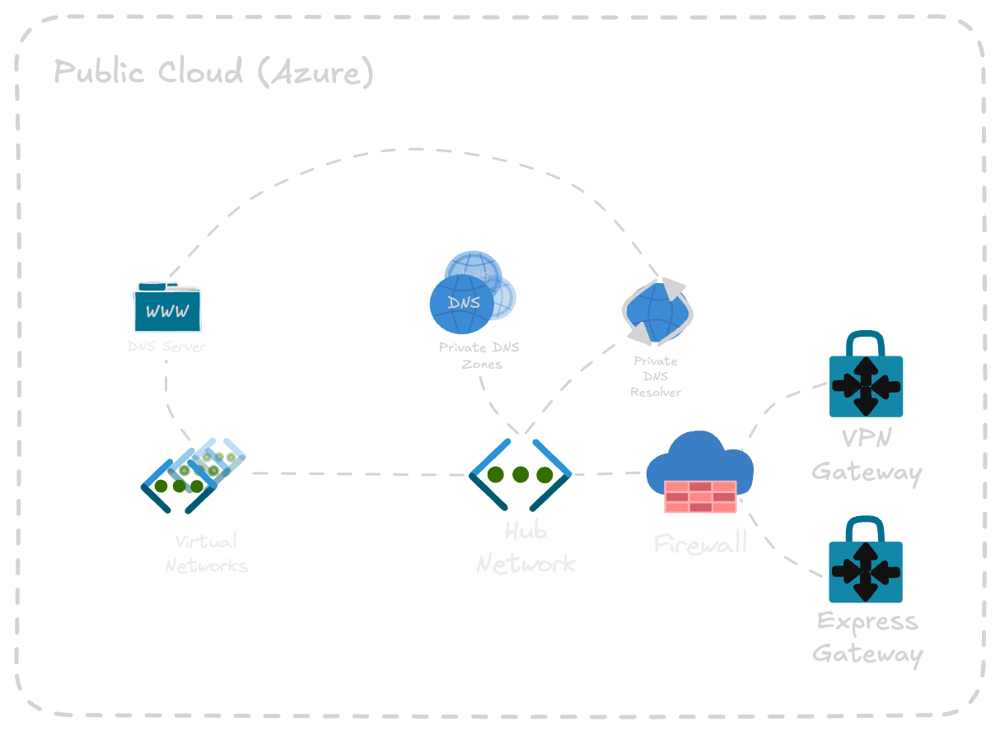

  
    Anton Ganhammar
  

  <h1>Clear Skies Ahead</h1>
  
Platform Acceleration with Azure Verified Modules

---
layout: section
---

  

# Where We Were

  

  

    
  

<!--
* I joined Aurobay, or Horse Powertrain.

* Large team, 7 people.
* Tasks was shielded from the developers, manual intervention.

* Started with a new workload, we where required to be there every step on the way.
* Not even possible for teams follow our architectural principels fully.
* For instance, IaC not possible, blocked from deploying parts of definition.

* Done right, Cloud Adoption Framework.
* Created using Azure Landing Zones, snapshot.
* Scale not considered.

* IaC was at best, an after thought. IaC not the leading source, exported nightly jobs.

* Inconsistencies in our environment.
* Automations does not like inconsistencies.

* Zero-trust to the extremes, for instance break-glass accounts with mfa fire proof lockers.
* Never trust the developers.
-->

---

# Split "Where We Were"

* Fast exit from Volvo, just fix it

---
layout: image-right
image: './assets/devops.png'
---

# Platform Engineering

> Platform Engineering is the application of DevOps principles at scale.

 

* Self-service within a secure, governed framework
* The platform is our product, the developers our customers
* Start with dirt trails, some will eventually become golden paths
* Centralize and scale specialized knowledge, reducing cognitve and manual work

<!--
* Platform Engineering is the application of DevOps principles at scale.
* The platform is our product, the developers our customers
* Self-service within a secure, governed framework
* Start with dirt trails, some will eventually become golden paths
* Centralize and scale specialized knowledge, reducing cognitve and manual work
* For Azure, Cloud Adoption Framework and specifically Azure Landing Zones is their way to handle platform engineering at scale
-->

---
layout: image-left
image: './assets/launch-pad.png'
---

# What Is an Azure Landing Zones?

* Azure Landing Zone = Secure, Governed Foundation for cloud workloads
* Prepares Azure Environment with policies, connectivity, and shared services
* Enables scalable and compliant workload deployments from day one

<!--
TO DO: REMOVE REPITIONS

* What is an Azure Landing Zone? It's the baseline architecture and configuration. 
* Sets the stage for successfully running our workloads in the cloud. 
* Launchpad — Strong, well-prepared foundation for your mission to succeed.
* Rockets can launch faster and more frequently due to our platform.
* Foundation not just about spinning up resources; security, governance and connectivity.
* Bumpers in a bowling alley keep the ball headed toward the pins. A well designed platform will keep the workload in line when it comes to organizational standards.
* Enables team to innovate freely while staying within safe boundaries.
* With an Azure Landing Zone in place, we avoid the “wild west” of unmanaged cloud resources.
* Every workload launches from the same secure and governed foundation.
* Enables scalability, operational excellence, and peace of mind as our cloud adoption grows.
* Let's look at some of the key building blocks of the platform.

TO DO: Introduce building blocks
-->

---
layout: image-right
image: './assets/management-groups.svg'
---

# Management Groups Hierarchy

* Organize subscriptions into a logical structure
* Apply governance (policies, RBAC) at scale through inheritance
* ALZ defines standard management groups:
  * **Corp**: Workloads requiring on-prem connectivity, stricter governance
  * **Online**: Internet-facing workloads, more autonomy

<!--
TO DO: Standard Mangement Groups overview split

* Management groups are containers that sit above subscriptions.
* Apply policies and access controls once, cascade down to subscriptions.
* In Azure Landing Zones, the Corp management group is for workloads that need to connect.
* Online is for public-facing services that don't need that connectivity.
* In cases with both is needed, recommended to expose API through Azure API Management.
* Teams need to choose which landing zone fits their workload's requirements.
-->

---

# Standard Mangement Groups overview

---
layout: image-right
image: './assets/policy.svg'
---

# Azure Policy

* Automated guardrails at scale
* Inherited from management groups
* Enforce standards (allowed regions, requried tags, etc.)
* Execute template deployment (e.g. inherit tags if not set)

<!--
* Automated guardrails at scale
* Inherited from management groups
* Enforce standards (allowed regions, requried tags, etc.)
* Execute template deployment (e.g. inherit tags if not set)
-->

---
layout: image-right
image: './assets/democracy-vs-autocracy.jpg'
---

# Azure Subscriptions

* Guarded process
* Leads to reuse and unclear boundries
* [ALZ promotes](https://learn.microsoft.com/en-us/azure/cloud-adoption-framework/ready/landing-zone/design-principles#subscription-democratization) democratization:
  * Units of management
  * Separate application environments
  * Self-service vending process
  * Offer multiple types to support differing requirements
  * Scalable management group hierarchy as a foundation

<!--
* Requesting a new subscripton, at the time, required a lot.
* Sandbox, architecture diagram.
* Once approved, creation manual, several elevated accounts.
* Lead to teams not requesting new subscriptions for new workloads.
* Subscriptions became buckets for entire streams.
* Doesn't align with the Azure Landing Zones philosophy, promotes democratization.
  * Units of management
  * Separate application environments
  * Self-service vending process
  * Offer multiple types to support differing requirements
  * Scalable management group hierarchy as a foundation
-->

---

# Network Architecture Design

<!--
* Horse Powertrain manufactures car parts.
* Majority of our employees works in factories around the globe.
* Software we build and maintain supports factories, response time crucial.
* A lot of infrastructure is on-prem, architectural principals promotes cloud first.
* Hybrid cloud setup, network extends into the private networks of the factories and office sites.
* To support this, we're following the hub-spoke network topology.
* Centralized architecture where a hub virtual network serves as the central point of connectivity.
* Spokes are isolated networks that manage workloads independently.
* The hub facilitates secure routing, cross-premises connectivity, DNS management, and remote access.
* Effective IP address management is critical.
* Huge flaw in arch diagram, lead to headaches and extra work.

TO DO: Hub-and-spoke into new slide?
-->

---
layout: image-right
image: './assets/private-endpoint.svg'
---

# Private Endpoint

* A network interface that uses a private IP from your virtual network
* Private, secure, connectivity powered by Azure Private Link
* Access existing DNS service configuration privately through private DNS zones

<!--
* A network interface that uses a private IP from your virtual network
* Private, secure, connectivity powered by Azure Private Link
* Access existing DNS service configuration privately through private DNS zones
-->

---
layout: image-right
image: './assets/getting-inside.png'
---

# The Process of Getting Inside

> I need to make my service accessible within our internal network (without exposing it publicly).

 

* _Step 1_: New spoke
* _Step 2_: New private endpoint
* _Step 3_: Firewall opening
* _Step 4_: Peer VNet with other VNet

<!--
* Pains of getting a subscription, getting inside the network was not easy either.
* Getting a spoke, Service Now request.
* An engineer calculated the next IP address range to allocate and stored in central table.
* Creating the Virtual Network and related resources was semi-manual.
* When more space was needed, new ticket, more manual work.
* To access the service, like a Storage Account, within the network, request Private Endpoint.
* Still not accessible outside of Azure, needed to request firewall opening.
* DNS resolver architecture issues often lead to additional requests to peer VNets.
-->

---
layout: statement
---

# Democratization
## With Azure Verified Modules for Terraform

---
layout: section
---

  

    <h1>Pain Points</h1>
    ☐ Subscriptions
     
    ☐ Network Vending
     
    ☐ Accessing Azure Services
  

  

    
  

---

# The Plan

1. Migrate platform resources to infrastructure-as-code
    * Management Groups
    * Policies
    * Private DNS Zones
    * Hub-Spoke Topology
1. Setup subscription vending, keep existing patterns
1. Add network infrastructure vending to the subscription vending
1. Automate DNS joins off private endpoints
1. Plead our case to open 443 network traffic towards Azure 

---
layout: image-left
image: './assets/avm-logo.png'
---

# Why Azure Verified Modules for Terraform?

* Retrofit a modern solution into an outdated structure
* Modular approach to deploying platform landing zones
* Over 130 resource/pattern/utility modules
* Owned, developed & supported by Microsoft
* Why not AVM for Bicep?

---
layout: section
---

## Step 1: Migrate Platform Resources

* Management Groups and Policy Pattern Module ([avm-ptn-alz](https://registry.terraform.io/modules/Azure/avm-ptn-alz))
* Hub and Spoke Pattern Module ([avm-ptn-alz-connectivity-hub-and-spoke-vnet](https://registry.terraform.io/modules/Azure/avm-ptn-alz-connectivity-hub-and-spoke-vnet/azurerm/0.16.2))
* Private DNS Zone for Private Link Pattern Module ([avm-ptn-network-private-link-private-dns-zones](https://registry.terraform.io/modules/Azure/avm-ptn-network-private-link-private-dns-zones))

---

# Step 2: Subscription Vending Machine

  

---
layout: section
---

  

    <h1>Pain Points</h1>
    ☑︎ Subscriptions
     
    ☐ Network Vending
     
    ☐ Accessing Azure Services
  

  

    
  

---

# Step 3: Vending Network Spokes

  

---
layout: image-right
image: './assets/ipam-logo.png'
---

# IP Address Management

* If you don't need a full blown tool: [avm-utl-network-ip-addresses](https://registry.terraform.io/modules/Azure/avm-utl-network-ip-addresses/azurerm/latest)
* Automatically discovers IP address utilization
* RESTful API to facilitate IP address management at scale with IaC
* Intuitive UI where users can get insights into IP address allocation
* Delivered via a container that can run on anything from Azure Functions to AKS/ACA

<!--
The solution to our struggle with IP address allocation.
-->

---
layout: section
---

  

    <h1>Pain Points</h1>
    ☑︎ Subscriptions
     
    ☑︎ Network Vending
     
    ☐ Accessing Azure Services
  

  

    
  

---
layout: section
---

## Step 4: Democratizing Private DNS Zones

Handle DNS joins through Azure Policies, provided through ALZ library and fix Private Resolver architecture.

---

# Private Resolver Architecture

  
  
  
  

<!--
We where lacking a proper private resolver DNS architecture. And, since no teams was allowed to manage their network resources, they had too request help from us, linking their VNets with the private DNS zones that they needed access to.
-->

---

  

    
  

  

    <h1>Centralized DNS Architecture</h1>
    
Microsoft <a href="https://learn.microsoft.com/en-us/azure/dns/private-resolver-architecture">describes</a> two private resolver architectures.

    
<strong>Centralized DNS:</strong>

    <ul>
      <li>Spoke VNets use the Private DNS Resolvers</li>
      <li>All DNS queries from spoke go to the hub</li>
      <li>Simpler configuration, slower resolution</li>
    </ul>
    
<strong>Distributed DNS:</strong>

    <ul>
      <li>Spoke VNets use Azure-provided DNS</li>
      <li>Each VNet resolves independently, spoke forwards via rules</li>
      <li>More complex to manage, but faster resolution</li>
    </ul>
  

<!--
This approach is refered to as "Centralized DNS Architecture" in the microsoft documentation. The other option covered in the documentation is "Distributed DNS Architecture".

* Centralized DNS:
  * Spoke VNets use the Private DNS Resolvers
  * All DNS queries from spoke go to the hub
  * Simpler configuration, slower resolution
* Distributed DNS:
  * Spoke VNets use Azure-provided DNS
  * Each VNet resolves independently, spoke forwards via rules
    * Forward specific queries (e.g., privatelink.* zones, on-prem domains) to the Private DNS Resolver in the hub
  * More complex to manage, but faster resolution
-->

---
layout: section
---

## Step 5: Pleading

Open traffic on port 443 towards Azure

---
layout: section
---

  

    <h1>Pain Points</h1>
    ☑︎ Subscriptions
     
    ☑︎ Network Vending
     
    ☑︎ Accessing Azure Services
  

  

    
  

---

# The Impact

* Subscriptions is no longer shielded through complicated request flows
* Virtual Network creation and amendment is a request away!
* Private Endpoints can be created by anyone:
  * They can be included in IaC definitions
  * The DNS names, and underlying service, can now be accessed within our network
* We're no longer a team driven by tickets and have time to innovate

<!--
Transistion to next slide: "Innovations such as:"
-->

---
layout: fact
---

# Thanks!
## Questions?
[linkedin.com/in/ganhammar](https://linkedin.com/in/ganhammar) | [github.com/ganhammar](https://github.com/ganhammar) | [ganhammar.se](https://ganhammar.se)
